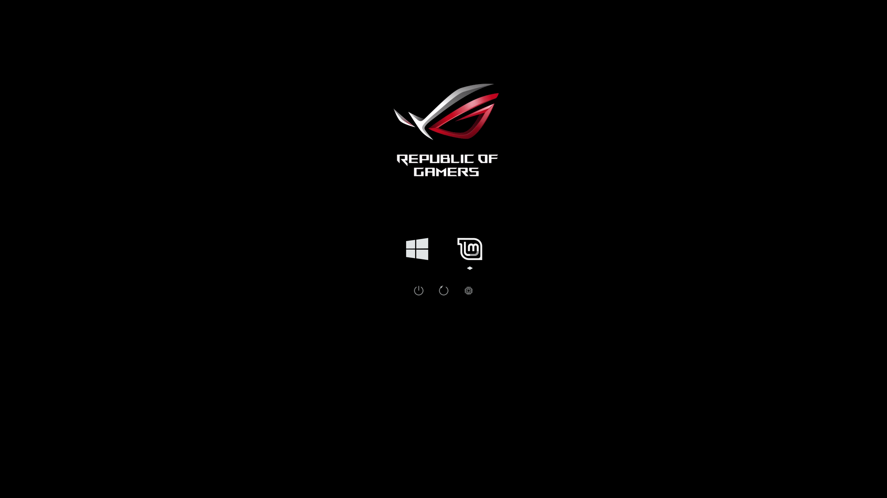

# Asus RoG rEFInd Theme

An unofficial Republic of Gamers theme for the [rEFInd boot manager](https://www.rodsbooks.com/refind/).

Based heavily on the [darkmini](https://github.com/LightAir/darkmini) theme.

I found the RoG logo somewhere on the internet and removed the background.
Note that the logo probably won't quite line up with your UEFI splash screen
(as it would overlap with the OS selection icons) but it looks okay anyway.



## Installation

1. Locate your rEFInd installation. In my case: `/boot/efi/EFI/refind`.
1. Clone this repo (or download the zip) to some other directory of your choice.
1. Copy the `rog` directory to the `themes` subdirectory of your refind installation (e.g. `/boot/efi/EFI/refind/themes/rog`).
1. Open the `refind.conf` file at the root of your refind installation in a text editor.
1. Locate the line starting with `include` towards the bottom of this file, 
   remove the leading `#` character if present and point it at the theme config:
   ```
   include themes/rog/rog-theme.conf
   ```
